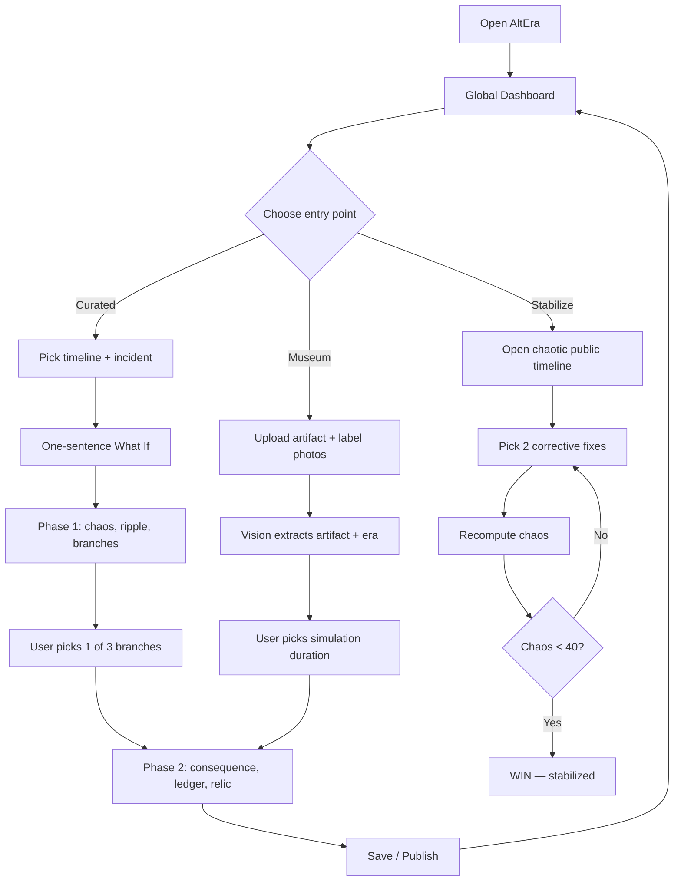
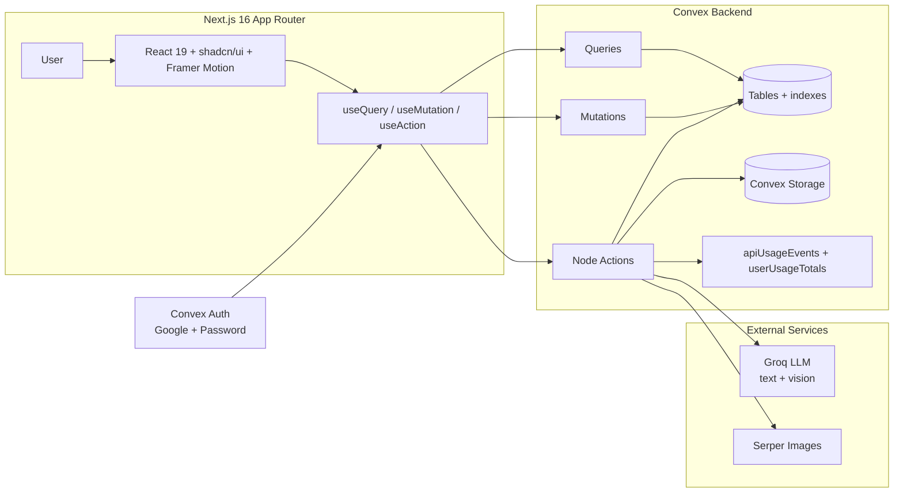

<div align="center">

# AltEra

### Simulate the Unseen.

**Change one moment in history. Watch a new timeline unfold.**

[](https://altera-sepia.vercel.app/)
[](https://youtu.be/uXwTIhtESJk)
[](https://nextjs.org/)
[](https://react.dev/)
[](https://convex.dev/)
[](https://groq.com/)
[](https://www.typescriptlang.org/)
[](#license)

**[Try it live →](https://altera-sepia.vercel.app/)** · **[Watch the demo →](https://youtu.be/uXwTIhtESJk)**

</div>

---

## Links

| | |
|---|---|
| Live app   | <https://altera-sepia.vercel.app/> |
| Demo video | <https://youtu.be/uXwTIhtESJk> |

---

## Table of Contents

- [Overview](#overview)
- [Key Features](#key-features)
- [Live Demo Flows](#live-demo-flows)
- [Architecture](#architecture)
- [Tech Stack](#tech-stack)
- [Quick Start](#quick-start)
- [Environment Variables](#environment-variables)
- [Project Structure](#project-structure)
- [Available Scripts](#available-scripts)
- [Documentation](#documentation)
- [Roadmap](#roadmap)
- [Contributing](#contributing)
- [License](#license)

---

## Overview

**AltEra** is an AI-powered alternate-history simulator built around the butterfly effect. Users pick a real historical incident (e.g. *the assassination of Archduke Franz Ferdinand, 1914*), enter a one-sentence **"What if?"** change, and the app generates a structured alternate timeline — complete with a chaos score, ripple effects, branching decisions, ledger of what's lost and gained, and a museum-style relic image from the new reality.

The product blends three experiences:

1. **Curated timelines** — start from a hand-curated incident.
2. **Museum scan** — photograph a real artifact + its label and let vision AI seed the simulation.
3. **Stabilize game** — repair a chaotic published timeline by picking corrective decisions until the chaos score drops below the win threshold.

All simulations are persisted in Convex with real-time subscriptions, so the global dashboard updates live as the community publishes new alternate realities.

---

## Key Features

- **Two-phase AI generation** — Phase 1 returns chaos score, immediate ripple, generational shift, and branch choices; Phase 2 returns global consequence, lost/gained ledgers, and a relic image prompt.
- **Museum vision flow** — Upload artifact + label photos; Groq vision (Llama 4) extracts name, era, and context, then proposes simulation durations.
- **Stabilize timeline game** — Pick corrective fixes to lower chaos below 40 and win.
- **Editable timelines** — Users can refine generated events inline before publishing.
- **Realtime global dashboard** — Public simulations stream in via Convex subscriptions.
- **Remix** — Branch from any public simulation with a new "What if?".
- **Demo Mode (`?demo=1`)** — Deterministic fixtures replace live LLM calls for safe presentations.
- **Usage telemetry** — Per-user Groq + Serper token & cost tracking.
- **Polished UI** — Framer Motion animations, OGL/Three.js aurora visuals, shadcn/ui + Tailwind v4.

---

## Live Demo Flows



---

## Architecture

AltEra is a thin Next.js frontend on top of a Convex backend. All long-running AI work happens inside Convex Node actions (`convex/actions/*`), which call **Groq** for text + vision and **Serper** for incident image enrichment. State and subscriptions are driven entirely by Convex.



See [`docs/HIGH_LEVEL_DESIGN.md`](docs/HIGH_LEVEL_DESIGN.md) for the full architecture, and [`docs/LOW_LEVEL_DESIGN.md`](docs/LOW_LEVEL_DESIGN.md) for module-level contracts.

---

## Tech Stack

| Layer            | Technology                                              |
|------------------|---------------------------------------------------------|
| Framework        | Next.js 16 (App Router, React 19, Turbopack)            |
| Language         | TypeScript 5.7 (strict)                                 |
| Styling          | Tailwind CSS v4 + shadcn/ui + Radix primitives          |
| Animations       | Framer Motion 12, OGL, Three.js, postprocessing         |
| Backend / DB     | Convex (queries, mutations, Node actions, storage)      |
| Auth             | `@convex-dev/auth` — Google OAuth + Password            |
| LLM (text)       | Groq (`llama-3.x` family) via OpenAI-compatible API     |
| LLM (vision)     | Groq Llama 4 Maverick / Scout (vision)                  |
| Image search     | Serper Images API (incident backfill, cached in Convex) |
| Analytics        | `@vercel/analytics`                                     |
| Deployment       | Vercel (frontend) + Convex Cloud (backend)              |

---

## Quick Start

### Prerequisites

- Node.js ≥ 20
- npm ≥ 10
- A free [Convex](https://convex.dev) account
- A [Groq](https://console.groq.com/keys) API key
- *(optional)* [Serper](https://serper.dev) key for incident image enrichment

### Setup

```bash
git clone https://github.com/<your-user>/altera.git
cd altera

cp .env.example .env.local

npm run install:all
```

### Run

Open two terminals from the repo root:

```bash
npx convex dev
```

```bash
npm run dev
```

- Frontend: <http://localhost:3000>
- Convex dashboard: link printed by `npx convex dev`

`npm run dev` automatically syncs Convex env vars into `frontend/.env.local` via `scripts/sync-env.mjs`.

### Configure secrets on Convex

```bash
npx convex env set GROQ_API_KEY <your-groq-key>
npx convex env set SERPER_API_KEY <your-serper-key>        # optional
npx convex env set SITE_URL http://localhost:3000/
npx convex env set AUTH_GOOGLE_ID <client-id>              # optional
npx convex env set AUTH_GOOGLE_SECRET <client-secret>      # optional
```

For demo presentations append `?demo=1` to any AltEra URL — the app uses deterministic fixtures instead of live LLM calls.

---

## Environment Variables

| Variable                     | Where        | Purpose                                              |
|------------------------------|--------------|------------------------------------------------------|
| `NEXT_PUBLIC_CONVEX_URL`     | `.env.local` | Auto-filled by `npx convex dev`                      |
| `NEXT_PUBLIC_CONVEX_SITE_URL`| `.env.local` | Auto-filled by `npx convex dev`                      |
| `CONVEX_DEPLOYMENT`          | `.env.local` | Auto-filled by `npx convex dev`                      |
| `GROQ_API_KEY`               | Convex env   | Required for live AI generation                      |
| `SERPER_API_KEY`             | Convex env   | Optional — incident image backfill                   |
| `SITE_URL`                   | Convex env   | OAuth redirect base URL                              |
| `AUTH_GOOGLE_ID/SECRET`      | Convex env   | Optional — Google OAuth                              |
| `DEMO_MODE`                  | Either       | Force fixture mode globally                          |

See [`.env.example`](.env.example) for the canonical list.

---

## Project Structure

```
.
├── convex/                  # Convex backend
│   ├── schema.ts            # Tables, indexes, validators
│   ├── auth.ts              # Convex Auth (Google + Password)
│   ├── simulations.ts       # Simulation CRUD (queries + mutations)
│   ├── simulationsInternal.ts
│   ├── engine.ts            # Orchestration actions (curated + remix)
│   ├── stabilization.ts     # Stabilize-game queries/mutations
│   ├── timelines.ts         # Predefined timelines + incidents
│   ├── published.ts         # Public feed
│   ├── museumScans.ts       # Museum upload + confirm
│   ├── usage.ts / usageInternal.ts
│   ├── actions/             # "use node" LLM actions
│   │   ├── generatePhaseOne.ts
│   │   ├── generatePhaseTwo.ts
│   │   ├── generateTimelineFromDuration.ts
│   │   ├── analyzeMuseumPhotos.ts
│   │   ├── stabilizeTimeline.ts
│   │   ├── suggestTimeDurations.ts
│   │   ├── generateRelicImage.ts
│   │   ├── fetchIncidentImages.ts
│   │   └── fetchSimulationEventImages.ts
│   ├── lib/                 # Groq client, normalizers, fixtures, billing
│   └── seed/                # Curated timelines + demo fixtures
│
├── frontend/                # Next.js 16 app
│   ├── app/                 # App Router pages
│   │   ├── dashboard/       # Global multiverse feed
│   │   ├── timelines/       # Curated timeline picker
│   │   ├── simulate/[id]/   # What-if + phase 1/2 viewer
│   │   ├── simulation/[id]/ # Public simulation viewer
│   │   ├── museum/          # Museum scan flow
│   │   ├── my-timelines/    # User's simulations
│   │   ├── community/       # Stabilize game entry
│   │   ├── signin/, signup/, login/, account/, profile/
│   │   ├── layout.tsx       # Convex providers + fonts
│   │   └── globals.css
│   ├── components/
│   │   ├── simulate/, simulation/, dashboard/, stabilize/
│   │   ├── timelines/, museum/, visuals/, ui/  # shadcn
│   │   └── layout/, auth/, home/
│   ├── lib/, hooks/, public/
│   └── proxy.ts             # Next.js middleware/proxy
│
├── docs/
│   ├── HIGH_LEVEL_DESIGN.md
│   ├── LOW_LEVEL_DESIGN.md
│   └── TEST_PROMPTS.md
├── scripts/
│   ├── sync-env.mjs         # Copy root .env.local → frontend
│   └── download-seed-images.mjs
├── DEMO.md                  # Judge demo script
├── AGENTS.md / CLAUDE.md    # AI agent instructions
└── package.json
```

---

## Available Scripts

From the repo root:

| Command                       | What it does                                             |
|-------------------------------|----------------------------------------------------------|
| `npm run install:all`         | Install root + frontend dependencies                     |
| `npm run dev`                 | Sync env vars and start the Next.js dev server           |
| `npm run dev:convex`          | Start Convex dev (`npx convex dev`)                      |
| `npm run dev:frontend`        | Start only the frontend after syncing env vars           |
| `npm run build`               | Production build of the frontend                         |
| `npm run start`               | Start the production frontend                            |
| `npm run lint`                | ESLint (Next.js + Convex rules)                          |
| `npm run sync-env`            | Copy root `.env.local` → `frontend/.env.local`           |
| `npm run fetch-incident-images` | Backfill incident images via Serper                    |

---

## Documentation

- [**DEMO.md**](DEMO.md) — Two-minute judge demo script (museum → curated → stabilize).
- [**docs/HIGH_LEVEL_DESIGN.md**](docs/HIGH_LEVEL_DESIGN.md) — System architecture, flows, scalability concerns.
- [**docs/LOW_LEVEL_DESIGN.md**](docs/LOW_LEVEL_DESIGN.md) — Module-level design, data model, API contracts.
- [**docs/TEST_PROMPTS.md**](docs/TEST_PROMPTS.md) — Hand-curated "What if?" prompts for QA.

---

## Roadmap

- AI video generation for cinematic timeline moments
- Interactive alternate world map
- Location-based historical mode using camera input
- Classroom mode (teacher / student roles)
- Community voting on best alternate timelines
- PDF export of timelines with generated images
- Multilingual simulations

---

## Contributing

This started as a buildathon project, but contributions are welcome.

1. Fork & branch from `main`.
2. Run `npm run install:all` and `npm run lint`.
3. Follow the rules in [`AGENTS.md`](AGENTS.md) — Convex conventions, Next.js 16 patterns.
4. Open a PR with a clear description and screenshots/clips for UI changes.

---

## License

Released under the [MIT License](LICENSE).

<div align="center">

Built with curiosity about the timelines that never were.

</div>
