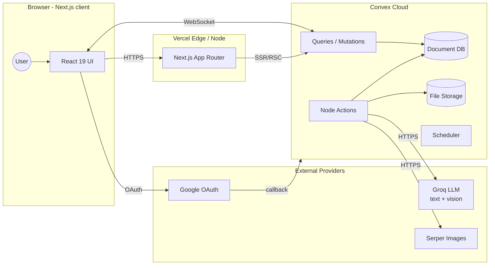
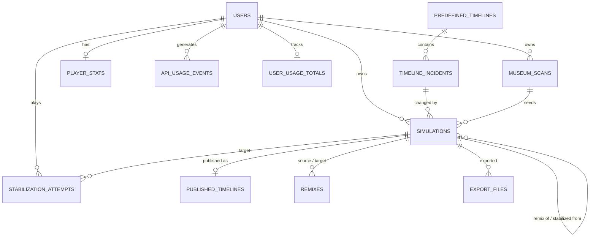
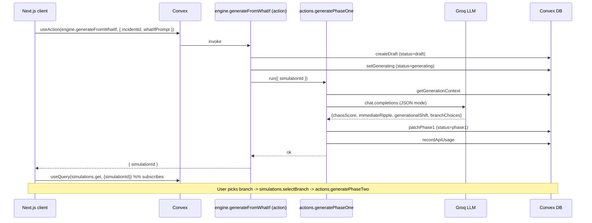
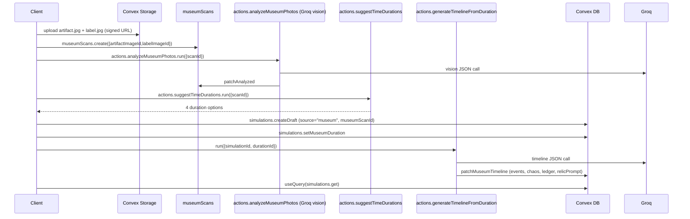
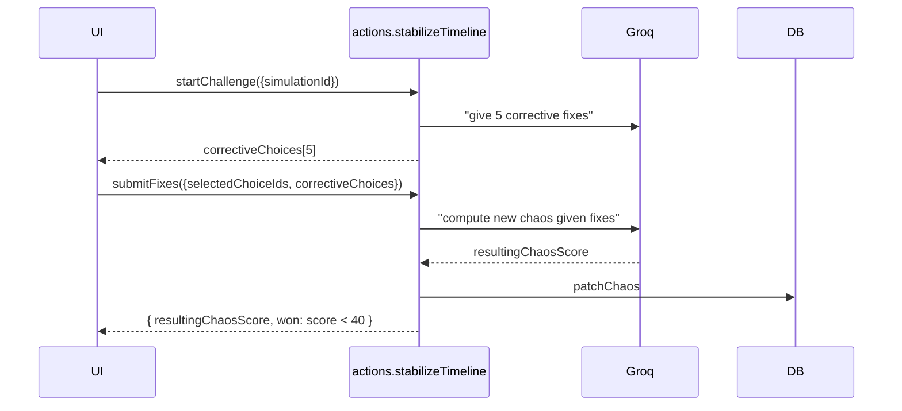
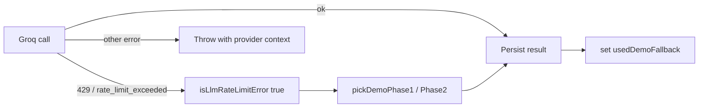
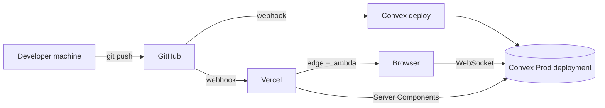

# AltEra — High-Level Design (HLD)

> System architecture, request flows, scaling considerations, and non-functional requirements.

---

## 1. Goals & Non-Goals

### 1.1 Product Goals

- Let a user change one real historical event and receive a **structured, plausible** alternate timeline within ~10 seconds.
- Make the experience interactive, not one-shot — branching decisions, ledgers, editable events, stabilize gameplay.
- Persist all simulations so they form a **community multiverse** that other users can browse and remix.
- Stay demo-safe — no live presentation should ever fail because the LLM provider is slow, rate-limited, or down.

### 1.2 Non-Goals (current scope)

- Multi-tenant organizations / enterprise SSO.
- Long-form video generation.
- Native mobile apps (web is mobile-responsive but not native).
- Server-side rendering of every LLM output (we stream/poll via Convex subscriptions instead).

### 1.3 Non-Functional Requirements

| Concern         | Target                                                              |
|-----------------|---------------------------------------------------------------------|
| Latency (UI)    | < 200 ms TTI for cached pages; LLM results stream within 5–10 s     |
| Reliability     | Demo Mode + fixture fallback on Groq 429 / outage                   |
| Cost ceiling    | Hard per-user spend cap enforced via `userUsageTotals`              |
| Security        | All public functions auth-checked; private sims invisible to others |
| Observability   | Every Groq/Serper call logged to `apiUsageEvents`                   |
| Portability     | LLM provider isolated behind `convex/lib/gemini.ts` + `groq.ts`     |

---

## 2. System Context



- The **only stateful service** is Convex Cloud. Vercel hosts a thin, mostly-stateless Next.js app.
- The browser holds a Convex WebSocket for realtime queries; mutations and actions are RPCs.
- External LLM and image-search calls happen **only from Convex actions**, never from the browser. Keys never leave the server.

---

## 3. Core Domain Model



Key invariants:

- A `simulations` row is a state machine: `draft → generating → phase1 → phase2 → saved → published`.
- `simulations.visibility = "private"` is invisible to all users except the owner (enforced in the `get` query).
- A `museumScan` always belongs to exactly one user, and may seed at most one simulation through `simulations.museumScanId`.
- Cost telemetry is **append-only** on `apiUsageEvents` with a denormalized rollup in `userUsageTotals`.

Full table definitions live in [`convex/schema.ts`](../convex/schema.ts) and are mirrored in [LLD §3](LOW_LEVEL_DESIGN.md#3-data-model).

---

## 4. Sub-systems

AltEra is intentionally split into independent vertical slices so that each demo flow can fail in isolation.

| Sub-system          | Owner files                                          | Responsibility                                                  |
|---------------------|------------------------------------------------------|-----------------------------------------------------------------|
| **Auth**            | `convex/auth.ts`, `frontend/components/auth/*`       | Google OAuth + Password, identity → `users` table mapping       |
| **Timeline catalog**| `convex/timelines.ts`, `convex/seed/*`               | Curated timelines, incidents, seed data, image enrichment       |
| **Simulation engine** | `convex/engine.ts`, `convex/simulations*.ts`, `convex/actions/generatePhase*.ts` | Two-phase LLM generation, normalization, persistence |
| **Museum scan**     | `convex/museumScans*.ts`, `convex/actions/analyzeMuseumPhotos.ts`, `convex/actions/generateTimelineFromDuration.ts`, `convex/actions/suggestTimeDurations.ts` | Vision extraction → duration choice → timeline gen |
| **Stabilize game**  | `convex/stabilization.ts`, `convex/actions/stabilizeTimeline.ts` | Fix-picking minigame, chaos recalc, win/loss persistence       |
| **Publishing & feed** | `convex/published.ts`, `convex/communityStats.ts`, `convex/platformStats.ts` | Public visibility, global dashboard, leaderboards          |
| **Remix**           | `convex/remix.ts`, `convex/engine.ts:remixFromSimulation` | Branch from public sim with new what-if                    |
| **Image enrichment**| `convex/incidentImagesInternal.ts`, `convex/simulationImagesInternal.ts`, `convex/lib/serper.ts` | Cached Serper image search + Convex storage    |
| **Usage telemetry** | `convex/usage.ts`, `convex/usageInternal.ts`, `convex/lib/recordApiUsage.ts`, `convex/lib/billingRates.ts` | Per-call cost ledger + per-user rollup             |
| **Demo safety net** | `convex/lib/demo.ts`, `convex/lib/demoFixtures.ts`, `convex/seed/demoData.ts` | Deterministic fixtures used on `?demo=1` or rate-limit  |

---

## 5. End-to-End Flows

### 5.1 Curated "What If?" generation



- **Why two phases?** It lets the UI render the ripple + branches as soon as Phase 1 lands, then resolve Phase 2 only after the user has picked a branch — keeping perceived latency low and token spend down.
- **Failure mode**: `generatePhaseOne` catches Groq 429s, falls back to `pickDemoPhase1` fixtures, and flags the simulation with `usedDemoFallback`.

### 5.2 Museum scan flow



### 5.3 Stabilize game



`CHAOS_WIN_THRESHOLD` lives in `convex/lib/constants.ts` and is the single source of truth for the win rule.

### 5.4 Remix

`engine.remixFromSimulation` reads the source simulation, creates a new draft via `remix.start`, then routes to either Phase 1 (curated) or `generateTimelineFromDuration` (museum) based on the original's `source`.

---

## 6. AI Architecture

### 6.1 Provider abstraction

All LLM access goes through one of two helpers:

- `convex/lib/groq.ts` — `generateJson<T>(system, user)` and `generateJsonWithImages<T>(system, parts[])`. Forces `response_format: json_object`.
- `convex/lib/gemini.ts` — historical alias kept for migration; today it re-exports the Groq client.

Models are centralized in `convex/lib/billingRates.ts` (`GROQ_TEXT_MODEL`, `GROQ_VISION_MODEL`) so swapping providers is a single-file change.

### 6.2 Output normalization

LLM outputs are never trusted directly. After every call we run:

- `normalizeTimelineEvents` — coerces `year` to string, clamps `impactLevel` to `"low" | "medium" | "high"`.
- `normalizeBranchChoices` / `normalizeCorrectiveChoices` — guarantee `id` is a string, dedupe.
- Chaos score → clamped to `[0, 100]`.

This protects the UI from impactLevel being an integer, branchChoice ids being numbers, etc.

### 6.3 Rate-limit & fallback policy



This is enforced in `generatePhaseOne`, `generatePhaseTwo`, `generateTimelineFromDuration`, and the museum vision path.

### 6.4 Cost & quota tracking

`recordGroqUsage(ctx, { userId, feature, model, usage, simulationId? | museumScanId? })` writes to `apiUsageEvents` and bumps the per-user rollup in `userUsageTotals`. Pricing comes from `convex/lib/billingRates.ts` so a model swap doesn't desync the ledger.

---

## 7. Frontend Architecture

- **Next.js 16 App Router** with React 19 Server Components for static shells and `"use client"` islands for interactive widgets (`components/simulation/*`).
- **Provider chain** (`app/layout.tsx`): `ConvexAuthNextjsServerProvider` → `ConvexClientProvider` → page tree.
- **Data fetching** is overwhelmingly client-side via `useQuery` / `useMutation` / `useAction` so realtime updates "just work". Public pages can be statically pre-rendered and hydrated.
- **UI kit**: shadcn/ui + Radix primitives, themed with Tailwind v4 (`globals.css` defines the design tokens).
- **Animations**: Framer Motion for layout transitions; OGL + Three.js for the aurora/relic visuals (`components/visuals/*`).
- **State**: no Redux/Zustand — Convex acts as the single source of truth; ephemeral UI state uses local `useState` / `useReducer` and `react-hook-form` + `zod` for forms.
- **Routing map** roughly mirrors the demo script:

  ```
  /                -> landing
  /dashboard       -> global multiverse feed
  /timelines       -> curated picker
  /simulate/[id]   -> what-if input + phase 1/2 viewer
  /simulation/[id] -> public viewer (read-only / share)
  /museum          -> upload + duration picker
  /community       -> stabilize game entry
  /my-timelines    -> user's saved sims
  /profile, /account, /signin, /signup, /login
  ```

---

## 8. Security & Privacy

- **Auth on every public function.** All Convex public functions call `requireUserId(ctx)` (mutations) or `getAuthUserId(ctx)` (queries) before reading or writing user data.
- **Visibility checks.** `simulations.get` returns `null` when `visibility = "private"` and the requester is not the owner; `simulations.getPublic` only returns public sims.
- **No secrets in the browser.** Groq, Serper, OAuth secrets live in the Convex environment. The frontend only knows the Convex URLs.
- **Storage URLs** are short-lived `ctx.storage.getUrl(...)` signatures, regenerated per query.
- **PII**: only email + display name + (optional) Google `image` URL are stored on the user record.

---

## 9. Demo Safety Net

| Scenario                                  | What happens                                                                |
|-------------------------------------------|-----------------------------------------------------------------------------|
| `?demo=1` in URL                          | `isDemoMode` returns true; every action short-circuits to fixtures.         |
| Groq 429 during phase 1/2                 | `isLlmRateLimitError` → fall back to `pickDemoPhase1/2`, set `usedDemoFallback`. |
| Groq 429 during museum vision             | Throws actionable error in prod, falls back to `demoMuseum.vision` if `?demo=1`. |
| Groq down (5xx)                           | Re-thrown with provider context; UI surfaces a retry button.                |
| Missing seed images                       | `download-seed-images.mjs` script repopulates `public/seed/`.               |

This is the single most important reliability feature — it's why AltEra is safe to demo live on flaky conference Wi-Fi.

---

## 10. Scalability & Performance Considerations

- **Reads scale automatically** through Convex subscriptions; the feed (`published.list`) is paginated and uses the `by_created` index.
- **Writes are small and bounded** (≤ a few hundred bytes per phase patch); LLM JSON sizes are capped by prompt design.
- **N+1 risks** are mitigated in `simulations.get` by batching `ctx.storage.getUrl` calls in `Promise.all` per event.
- **Hot path** = action `generatePhaseOne` → 1 Groq call → 1 mutation. Single-digit-second p99.
- **Image cache** (`incidentImageCache`) makes the Serper enrichment idempotent and free on subsequent runs.
- **Costs** scale linearly with simulations; per-user caps can be enforced by checking `userUsageTotals.totalCostUsd` before invoking actions.

### Known bottlenecks

- Groq vision (`analyzeMuseumPhotos`) downloads images server-side and base64-encodes them; large artifact photos can hit token limits. Mitigation: enforce client-side image resizing before upload.
- The dashboard query collects without pagination on the cold path; for > 1k public sims we'd add cursor pagination.

---

## 11. Deployment Topology



- **Frontend**: Vercel project pointing at `frontend/`. `vercel.json` controls the proxy.
- **Backend**: `npx convex deploy --prod` (manual or CI). Env vars (`GROQ_API_KEY`, `SITE_URL`, OAuth) are managed via `npx convex env set --prod`.
- **Preview**: every PR gets a Vercel preview URL paired with a Convex dev deployment (one per developer).

---

## 12. Observability

- **Server logs**: Convex dashboard → Functions tab → per-call latency and errors.
- **Cost ledger**: `apiUsageEvents` + `userUsageTotals` (queryable via `convex/usage.ts`).
- **Analytics**: `@vercel/analytics` enabled in production only (`app/layout.tsx`).
- **Client error surfaces**: `sonner` toasts + `editable-timeline-events` retry buttons.

---

## 13. Risks & Mitigations

| Risk                                                | Mitigation                                                    |
|-----------------------------------------------------|---------------------------------------------------------------|
| LLM hallucinates nonsense for niche incidents       | Prompt always includes real `realOutcome` + `description`; normalizers reject malformed JSON. |
| Provider outage during demo                         | `DEMO.md` checklist; `?demo=1`; fixture fallback on 429.      |
| Runaway token spend                                 | Per-call cost recorded; soft cap via `userUsageTotals`.       |
| Schema drift between Convex + frontend types        | `convex/types/contracts.ts` shared as source of truth.        |
| OAuth misconfig on a new env                        | `.env.example` lists exact `SITE_URL` + redirect format.      |
| Image moderation on user-uploaded artifacts         | Currently absent — flagged as roadmap item.                   |

---

## 14. Open Questions / Future Work

- Replace polling for long simulations with explicit Convex scheduler jobs once we add multi-step generation.
- Add a moderation pipeline before public publishing (text + image).
- Move incident image enrichment into a Convex `cron` instead of a manual script.
- Add OpenTelemetry export from Convex actions for end-to-end tracing.

See the LLD ([`docs/LOW_LEVEL_DESIGN.md`](LOW_LEVEL_DESIGN.md)) for the implementation-level breakdown.
